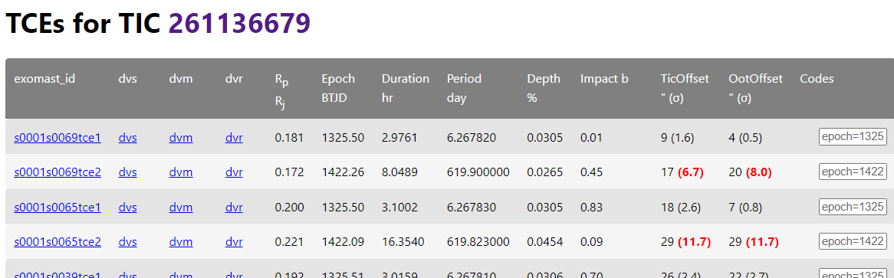

# TESS TCE Data Validation (DV) Reports Fast Lookup

A Python package / webapp that provides a fast lookup of TESS threshold crossing event (TCE) data validation reports from SPOC (2 minute cadence) pipeline and TESS-SPOC (FFI / HLSP) pipeline.

For SPOC, it also provides a summary of key TCE parameters, e.g. looking up all the TCEs for [pi Men / TIC 261136679](https://exofop.ipac.caltech.edu/tess/target.php?id=261136679):




## Installation

In your Python virtual environment, install the dependency

Using `pip`:

```shell
pip install -r requirements.txt
```

Using `conda`:

```shell
conda install --file requirements.txt
```

Download the required data and build the local database.

```shell
python tess_dv_fast_build.py --update --minimal_db
python tess_spoc_dv_fast_build.py --update
```

Start the webapp:

```shell
flask --app tess_dv_fast_webapp run
```

You are done! The app will be available at http://localhost:5000/tces .


Notes:

- To change the port of the webapp, add `-p <port_number>` to `flask` line.
- The packages downloads the data from MAST and creates a local sqlite databases at `data/tess_dv_fast/tess_tcestats.db` (SPOC) and  `data/tess_dv_fast/tess_spoc_tcestats.db` (TESS-SPOC) . There is also a csv version in the same directory.
- For SPOC, the sqlite database contains a minimal set of data needed to support the webapp. Optionally, you could create a database with all the TCE parameters provided by MAST by omitting `--minimal-db`.
- It is tested on Python 3.10, but should be compatible with any recent Python3 versions.


## Adding new data

The package relies on TCE bulk download data provided by MAST. When new data is available, the local database needs to be updated.

1. In `tess_dv_fast_spec.py` (SPOC),
    - update `sources_tcestats_single_sector` and `sources_tcestats_multi_sector` to include the URLs of the new TCE `csv` files at: https://archive.stsci.edu/tess/bulk_downloads/bulk_downloads_tce.html .
    - update `sources_dv_sh_single_sector` and `sources_dv_sh_multi_sector` to include the URLs of the new DV download `sh` files at: https://archive.stsci.edu/tess/bulk_downloads/bulk_downloads_ffi-tp-lc-dv.html .

2. In `tess_spoc_fast_spec.py` (TESS-SPOC),
    - update `sources_dv_sh_single_sector` and `sources_dv_sh_multi_sector` to include the URLs of the new DV download `sh` files at: https://archive.stsci.edu/hlsp/tess-spoc .

3. Update the database:

```shell
python tess_dv_fast_build.py --update --minimal_db
python tess_spoc_dv_fast_build.py --update
```

## Deploying the app to cloud environments

- Instructions for [Google Cloud Run deployment](tess_dv_fast_webapp_gcloud/README.md).
